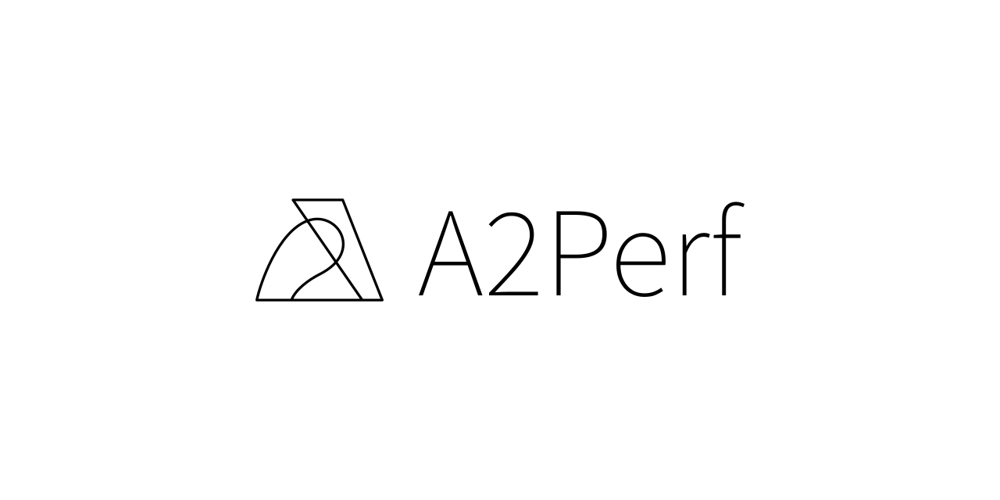
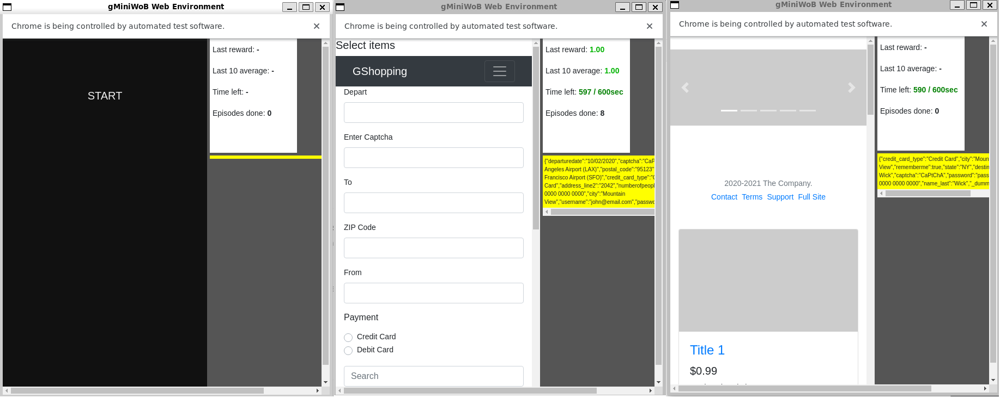
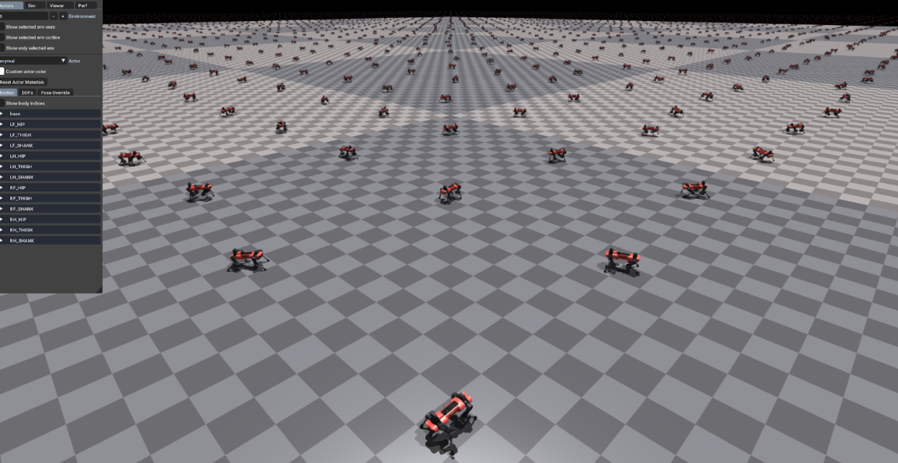
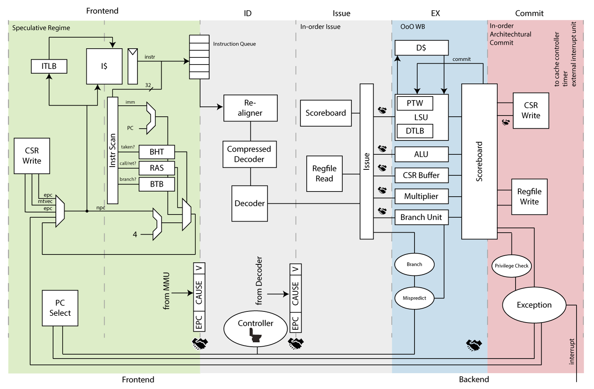

[](https://github.com/psf/black)

[//]: # ([![Python]&#40;https://img.shields.io/pypi/pyversions/gymnasium.svg&#41;]&#40;https://badge.fury.io/py/gymnasium&#41; TODO: Add working Python versions once a2perf package is available)

[//]: # ([![PyPI]&#40;https://badge.fury.io/py/gymnasium.svg&#41;]&#40;https://badge.fury.io/py/gymnasium&#41;
TODO: Add PyPI once a2perf package is available)

[//]: # ([![arXiv]&#40;https://img.shields.io/badge/arXiv-2407.17032-b31b1b.svg&#41;]&#40;https://arxiv.org/abs/2407.17032&#41; TODO: Add arXiv once we have DOI link)


<p align="center">
    
</p>
A2Perf is a benchmark for evaluating agents on sequential decision problems that
are relevant to the real world. This
repository contains code for running and evaluating participant's submissions on
the benchmark platform.

## Environments

A2Perf provides benchmark environments in the following domains:

* [Web Navigation](docs/content/web_navigation/WebNavigation-Difficulty-01-v0.ipynb) -
  This environment facilitates the
  creation of compositional tasks represented by dependency graphs, where
  automatically generated websites are completed by the trained agent.
* [Quadruped Locomotion](docs/content/quadruped_locomotion/QuadrupedLocomotion-DogPace-v0.ipynb) -
  This quadruped
  locomotion environment aims to teach a legged robot with 18 degrees of freedom
  to replicate animal-like behaviors by imitating real-world motion data to
  develop a diverse repertoire of skills.
* [Circuit Training](docs/content/circuit_training/CircuitTraining-Ariane-v0.ipynb) -
  Chip floorplanning, a
  complex and traditionally manual process, has been addressed by Google's
  open-source Circuit Training framework, which uses reinforcement learning to
  optimize chip layouts for multiple objectives.

<!--
### Web Navigation



### Quadruped Locomotion



### Chip Floorplanning

 -->

## Installation

A2Perf can be installed on your local machine:

```bash
git clone https://github.com/Farama-Foundation/A2Perf.git
cd A2Perf
git submodule sync --recursive
git submodule update --init --recursive
pip install -e .[all]
```

### Specific Package installation

To install specific packages, you can use the following commands:

```bash
pip install -e .[web_navigation]
pip install -e .[quadruped_locomotion]
pip install -e .[circuit_training] && python setup.py circuit_training
```

Both x86-64 and Arch64 (ARM64) architectures are supported.
\
Please note that the Windows version is not as well-tested as Linux and macOS
versions.
It can be used for development and testing but if you want to conduct serious (
time and resource-extensive) experiments on Windows,
please consider
using [Docker](https://docs.docker.com/docker-for-windows/install/)
or [WSL](https://docs.microsoft.com/en-us/windows/wsl/install-win10) with Linux
version.

## API

Environments in A2Perf are registered under specific names for each domain and
task. Here are the available environments:

1. Quadruped Locomotion:
    - `QuadrupedLocomotion-DogPace-v0`
    - `QuadrupedLocomotion-DogTrot-v0`
    - `QuadrupedLocomotion-DogSpin-v0`

2. Web Navigation:
    - `WebNavigation-Difficulty-01-v0`
    - `WebNavigation-Difficulty-02-v0`
    - `WebNavigation-Difficulty-03-v0`

3. Circuit Training:
    - `CircuitTraining-ToyMacro-v0`
    - `CircuitTraining-Ariane-v0`

For example, you can create an instance of the `WebNavigation-Difficulty-01-v0`
environment as follows:

```python
import gymnasium as gym

from a2perf.domains import web_navigation

env = gym.make("WebNavigation-DifficultyLevel-01-v0", num_websites=10, seed=0)

```

## User Submission

A beginners guide to benchmarking with A2Perf is
described [here](docs/content/tutorials/training.md).

- Users can pull the template repository
  at https://github.com/Farama-Foundation/a2perf-benchmark-submission
    - The submission repository must include:
        - `train.py` - defines a global `train` function with the following
          signature:
          ```python
          def train():
            """Trains the user's model."""
          ```
        - `inference.py` - defines the following functions:
          ```python
          def load_policy(env, **load_kwargs):
            """Loads a trained policy model from the specified directory."""
          def infer_once(policy, observation):
            """Runs a single inference step using the given policy and observation."""
          def preprocess_observation(observation):
            """Preprocesses a raw observation from the environment into a format compatible with the policy."""
          ```
        - `requirements.txt` - lists the required Python packages and
          their versions for running the user's code
        - `__init__.py` - an empty file that allows the submission to be
          imported as a Python module

## Gin Configuration Files

Under [
`a2perf/submission/configs`](https://github.com/Farama-Foundation/A2Perf/tree/main/a2perf/submission/configs),
there are default gin configuration files for training and inference for each
domain. These files define various settings and parameters for
benchmarking.

Here's an example of an `training.gin` file for web navigation:

```python
# ----------------------
# IMPORTS
# ----------------------
import a2perf.submission.submission_util

# ----------------------
# SUBMISSION SETUP
# ----------------------
# Set up submission object
Submission.mode = %BenchmarkMode.TRAIN
Submission.domain = %BenchmarkDomain.WEB_NAVIGATION
Submission.run_offline_metrics_only = False
Submission.measure_emissions = True

# ----------------------
# SYSTEM METRICS SETUP
# ----------------------
# Set up codecarbon for system metrics
track_emissions_decorator.project_name = 'a2perf_web_navigation_train'
track_emissions_decorator.measure_power_secs = 5
track_emissions_decorator.save_to_file = True  # Save data to file
track_emissions_decorator.save_to_logger = False  # Do not save data to logger
track_emissions_decorator.gpu_ids = None  # Enter list of specific GPU IDs to track if desired
track_emissions_decorator.log_level = 'info'  # Log level set to 'info'
track_emissions_decorator.country_iso_code = 'USA'
track_emissions_decorator.region = 'Massachusetts'
track_emissions_decorator.offline = True
```

## Baselines

Baselines for all tasks are provided and are described in the article supporting
A2Perf.

## Environment Versioning

A2Perf keeps strict versioning for reproducibility reasons. All environments end
in a suffix like "-v0". When changes are made to environments that might impact
learning results, the number is increased by one to prevent potential confusion.
This follows the Gymnasium convention.

[//]: # (## Citation)

[//]: # ()

[//]: # (You can cite A2Perf as:)

[//]: # ()

[//]: # (```bibtex)

[//]: # (@misc{TODO })

[//]: # (```)
