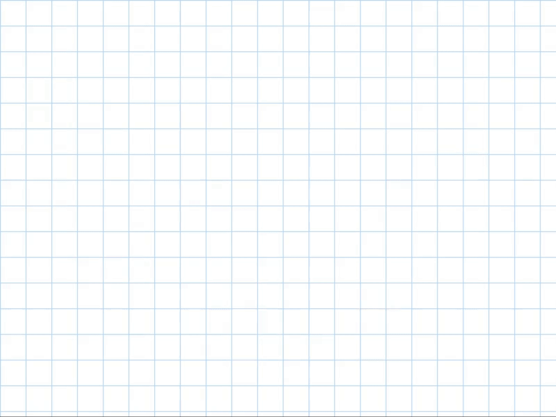

# Circuit Training Environments

<style>
.env-container {
    display: flex;
    justify-content: center;
    width: 100%;
}
.env-list {
    display: flex;
    flex-wrap: wrap;
    gap: 20px;
    justify-content: center;
}
.env-item {
    width: 200px;
    text-align: center;
}
.env-item img {
    width: 200px;
    height: 200px;
    object-fit: cover;
}
.env-item a {
    display: block;
    margin-top: 10px;
    text-decoration: none;
    color: #0366d6;
}
</style>
<div class="env-container">
    <div class="env-list">
        <div class="env-item">
            
            <a href="CircuitTraining-Ariane-v0">Ariane</a>
        </div>
        <div class="env-item">
            
            <a href="CircuitTraining-ToyMacro-v0">Toy Macro Netlist</a>
        </div>
    </div>
</div>

```{toctree}
:hidden:
:caption: Circuit Training Environments

CircuitTraining-Ariane-v0
CircuitTraining-ToyMacro-v0
```
